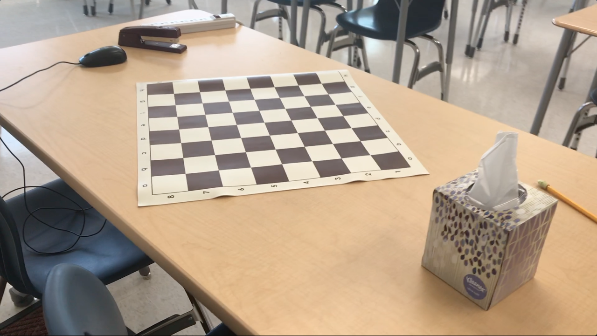

# AR-Solids
Augmented reality project using OpenCV to render platonic solids in the center of a chessboard in a video

The input, chessboard.mov, is a video revolving around a chessboard. The output, result.avi, is the same video with a stationary platonic solid rendered on top of the chessboard.

### Sample Input Video Frame

### Sample Output Video Frame

